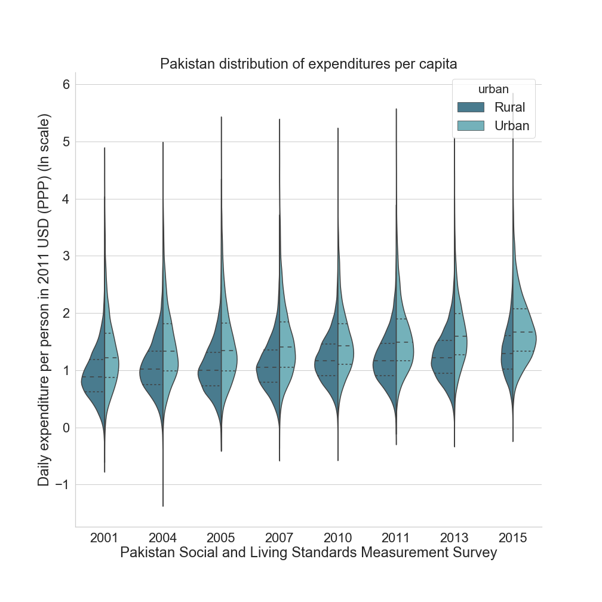

# South Asia Violin Plots
## Python for Data Science
**Objective:** Generate violin plots for expenditures per capita for every survey available in South Asia by urban/rural.

**Author:** Francisco Javier Parada Gomez Urquiza <fparadagomezurqu@worldbank.org>

